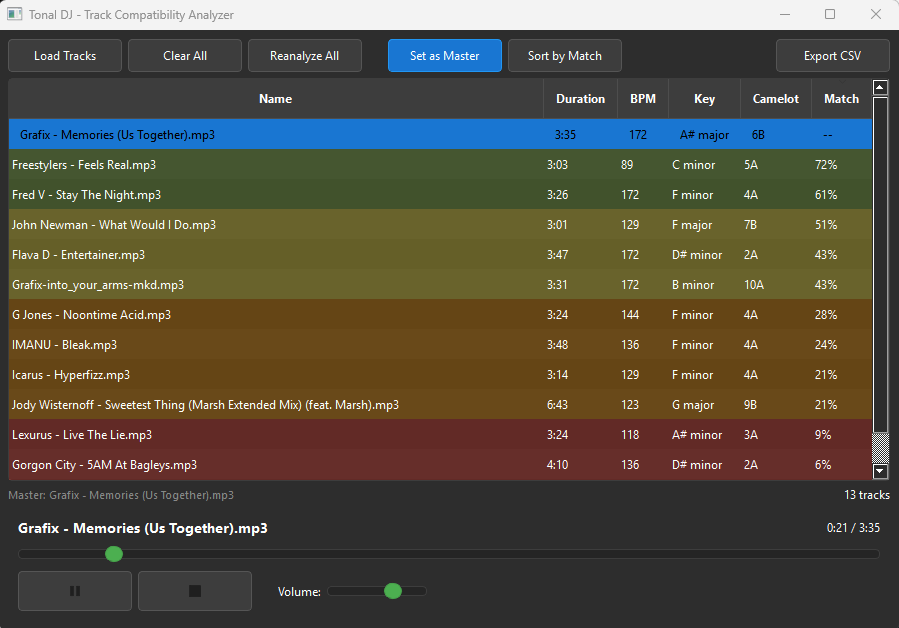

# Tonal DJ - AI-Powered Track Compatibility Analyzer

[Русская версия](README_RU.md)

A desktop application for DJs that uses **AI-powered audio analysis** to find compatible tracks based on musical content, key, and BPM for seamless mixing.



## AI Features

- **Content-Based Matching** - Uses CLAP (Contrastive Language-Audio Pretraining) neural network to analyze audio content and find sonically similar tracks
- **AI Genre Classification** - Automatic genre detection (Drum & Bass, House, Techno, Dubstep, Trance, etc.)
- **AI Mood Detection** - Classifies track mood (Energetic, Dark, Melodic, Aggressive, Uplifting, etc.)
- **Combined Scoring** - Intelligent combination of harmonic compatibility and content similarity

## Core Features

- **BPM Detection** - Automatic tempo detection using beat tracking
- **Key Detection** - Musical key detection using Krumhansl-Schmuckler algorithm
- **Camelot Wheel** - Automatic conversion to Camelot notation for harmonic mixing
- **Compatibility Scoring** - Calculate match percentage between tracks based on key and BPM
- **BPM Multiplier** - Support for half-time (x0.5) and double-time (x2) tempo relationships
- **MP3 Metadata** - Read/write analysis results to MP3 ID3 tags
- **Local Cache** - SQLite database for fast loading of previously analyzed tracks
- **Audio Playback** - Built-in player to preview tracks
- **Multi-language** - English and Russian interface
- **Drag & Drop** - Easy file loading
- **CSV Export** - Export track list with compatibility data

## Installation

1. Clone the repository:
```bash
git clone https://github.com/NuclearAPK/tonaldjanalyzer.git
cd tonaldjanalyzer
```

2. Install dependencies:
```bash
pip install -r requirements.txt
```

3. Run the application:
```bash
python main.py
```

## Requirements

- Python 3.8+
- PyQt5
- PyTorch
- Transformers (for CLAP model)
- librosa
- numpy, scipy
- soundfile, pygame
- mutagen

## Usage

1. **Load Tracks** - Click "Load Tracks" or drag & drop audio files
2. **Set Master Track** - Select a track and click "Set as Master"
3. **AI Analysis** - Click "Analyze AI" to run content analysis on all tracks
4. **View Compatibility** - All tracks show combined compatibility (harmonic + content)
5. **Sort by Match** - Click "Sort Match" to order tracks by compatibility
6. **Adjust BPM** - Right-click to set BPM multiplier (x0.5, x1, x2)
7. **Export** - Click "Export CSV" to save results

## How AI Matching Works

The CLAP model creates audio embeddings (512-dimensional vectors) that capture the sonic characteristics of each track. When you set a master track, the app calculates cosine similarity between embeddings to find tracks that sound similar - regardless of key or BPM.

The final **Match** score combines:
- **Harmonic compatibility** (key/Camelot matching)
- **Content similarity** (AI-based audio analysis)

## Supported Audio Formats

MP3, WAV, FLAC, OGG, M4A, AAC

## License

MIT License
